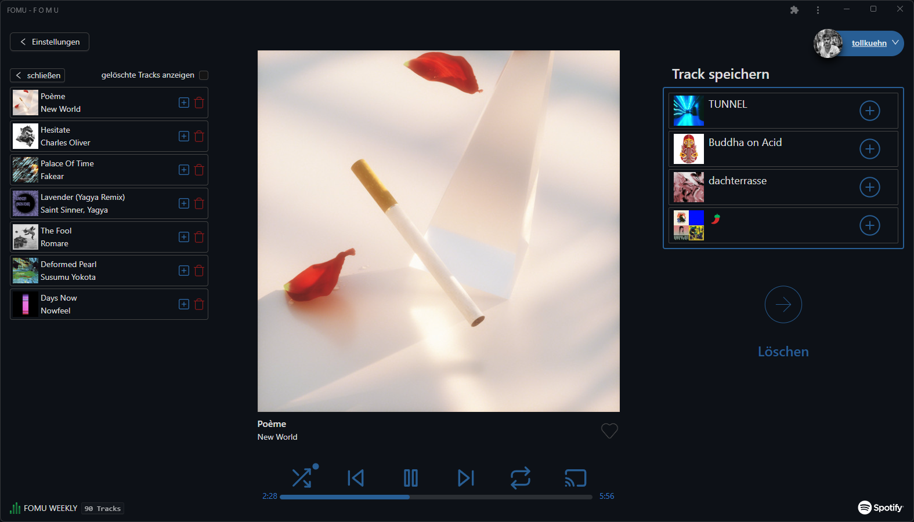

<!-- PROJECT LOGO -->
 

  

  

    <a href="https://fomu.app">View Demo</a>
    ·
    <a href="https://github.com/maxikuehn/fomu/issues">Report Bug</a>
    ·
    <a href="https://github.com/maxikuehn/fomu/issues">Request Feature</a>
  

   

## About The Project

A Spotify Player with smart Playlist-Features.

### Built With

- [Vite](https://vitejs.dev/)
- [React.js](https://react.dev/)
- [Ant Design](https://ant.design/)
- [Tailwind CSS](https://tailwindcss.com/)
- [Spotify Web API](https://developer.spotify.com/documentation/web-api/)
- [Netlify](https://www.netlify.com/)

## Contributing

If you have a suggestion that would make this better, please fork the repo and create a pull request. You can also simply open an issue with the tag "enhancement".

1. Fork the Project
2. Create your Feature Branch (`git checkout -b feature/AmazingFeature`)
3. Commit your Changes (`git commit -m 'Add some AmazingFeature'`)
4. Push to the Branch (`git push origin feature/AmazingFeature`)
5. Open a Pull Request

## Contact

Project Link: [github.com/maxikuehn/fomu](https://github.com/maxikuehn/fomu)  
Email Contact: [mail@fomu.app](mailto:mail@fomu.app)

(<a href="#top">back to top</a>)

